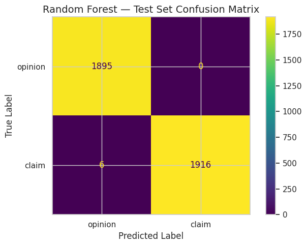
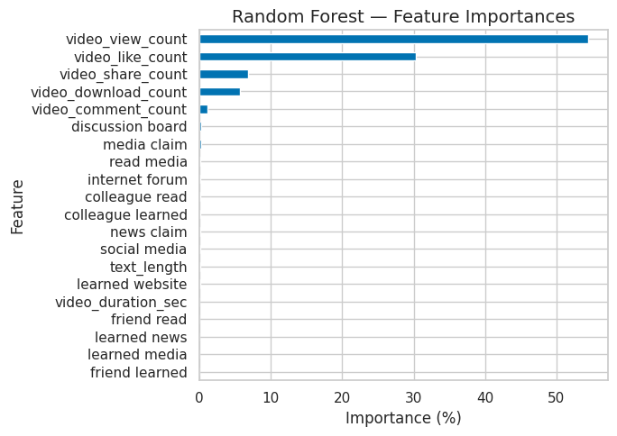

# 00 — Case Study Overview: TikTok Claims Classification

**Owner:** Katherine Ygbuhay  
**Date:** October 2025

---

## Business Question
Can we automatically classify TikTok videos as **factual claims** vs. **subjective opinions** to accelerate moderation and reduce backlog?

## Dataset (At a Glance)
- Source: Flagged TikTok videos (sample, non-sensitive)
- Target: `claim_status` ∈ {`Claim`, `Opinion`}
- Key features: duration (sec), views, likes, shares, comments, text length
- Notes: English-only in this phase; account metadata contributed minimally

## Methods (Summary)
- Baseline: Logistic Regression
- Advanced: Random Forest, XGBoost
- **Champion:** Random Forest (balanced precision/recall, interpretability)

## Key Results
- **Random Forest (Test Set)**  
  - Recall (Claim) = **0.997**  
  - Precision (Claim) = **1.000**  
  - F1 (Claim) = **0.998**  
  - Accuracy (Overall) = **0.998**  

- Engagement features (views, likes, shares, duration) were the strongest predictors.  
- Metadata features (verification, ban status) contributed minimally.

## Visuals

  

  

## Minimal Workflow (For Readers)
1. Load and clean data  
2. Feature engineering (text length; engagement ratios)  
3. Model training and tuning (RF, XGB)  
4. Evaluate (accuracy, precision, recall, F1; confusion matrices)  
5. Interpret (feature importances) and recommend champion model

## Recommendation (TL;DR)
- **Deploy**: Random Forest pipeline as champion model  
- **Monitor**: Monthly precision/recall for `Claim` class; alert on >2–3 pt swings  
- **Human-in-the-loop**: Preserve reviewer override; audit false negatives weekly  
- **Next phase**: Add report-based metrics & multilingual support

## Links
- [Executive Summary](../docs/stakeholders/executive_summary_tiktok_claims.md)  
- [Evaluation & Recommendation Report](../docs/stakeholders/evaluation_recommendation_report_tiktok_claims.md)  
- Full Notebooks: `02_data_exploration.ipynb` → `06_tree_models_recommendation.ipynb`

