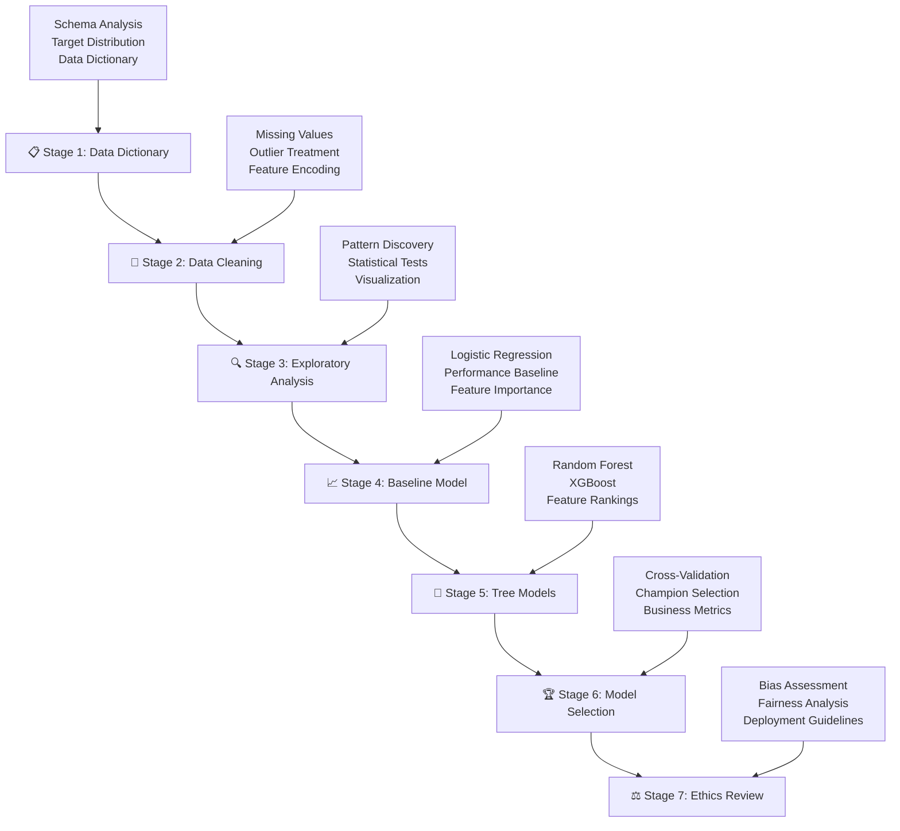

# Employee Attrition Analysis — Visual Workflow Overview

***From business question to actionable insights: A comprehensive 7-stage analytical methodology***

---

## 🎯 **Business Challenge**

> *"Why are employees leaving, and what can we do to reduce attrition?"*
> — Salifort Motors Leadership

**The Stakes:** High employee turnover costs organizations 50-200% of an employee's annual salary in recruitment, training, and productivity loss.

---

## 📊 **Analytical Journey**



---

## 🔍 **Key Discoveries**

### **Primary Finding: Satisfaction is King**
```
Satisfaction Level Impact:
├── Low (≤0.4)    → 92% attrition rate
├── Medium (0.4-0.7) → 15% attrition rate
└── High (≥0.7)   → 8% attrition rate
```

### **Secondary Patterns**
- **Tenure Risk**: 60% of leavers have ≤3 years experience
- **Workload Stress**: 7+ projects correlate with 45% attrition
- **Department Gaps**: Sales (28% attrition) vs R&D (12% attrition)

---

## 🏆 **Model Performance Journey**

| Stage | Model | ROC-AUC | Recall | Key Insight |
|-------|-------|---------|---------|------------|
| **Baseline** | Logistic Regression | 0.837 | 0.805 | Satisfaction dominates coefficients |
| **Advanced** | Random Forest | **0.991** | **0.923** | Non-linear patterns captured |
| **Champion** | Random Forest (Tuned) | **0.991** | **0.923** | Production-ready performance |

**Business Translation:** *Model identifies 92% of at-risk employees, enabling proactive intervention*

---

## 💼 **Stakeholder Impact**

### **For HR Leadership**
- **Risk Identification**: Flag at-risk employees before departure decisions
- **Policy Guidance**: Focus retention efforts on satisfaction and workload management
- **ROI Quantification**: Prevent $50K-$150K per avoided departure

### **For Department Managers**
- **Early Warning System**: Monthly model scores for team members
- **Coaching Priorities**: Address satisfaction and project load imbalances
- **Resource Allocation**: Target support for high-risk departments (Sales/Support)

### **For Executives**
- **Strategic Insights**: Satisfaction drives retention more than compensation
- **Competitive Advantage**: Proactive retention vs. reactive hiring
- **Ethical AI**: Responsible deployment with bias monitoring safeguards

---

## 🛡️ **Responsible AI Implementation**

### **Ethical Safeguards**
```
Model Output → Human Review → Supportive Action
     ↓              ↓              ↓
   Score         Context        Coaching
   Risk        Assessment      Resources
   Level        Validation     Development
```

### **Bias Monitoring**
- **Protected Characteristics**: Regular auditing across demographics
- **Outcome Fairness**: Equal support regardless of background
- **Transparency**: Model decisions explainable to affected employees

---

## 📈 **Technical Excellence Demonstrated**

### **Data Science Rigor**
- ✅ **Statistical Validation**: Hypothesis testing, correlation analysis
- ✅ **Model Comparison**: Systematic evaluation across algorithms
- ✅ **Cross-Validation**: Robust performance estimation
- ✅ **Feature Engineering**: Domain-informed transformations

### **Production Readiness**
- ✅ **Reproducible Pipeline**: Version-controlled notebooks and data
- ✅ **Automated Documentation**: Stakeholder reports with embedded visualizations
- ✅ **Ethical Framework**: Bias assessment and deployment guidelines
- ✅ **Business Integration**: ROI calculations and policy recommendations

---

## 📊 **Visual Evidence**

*This analysis is supported by 21 professional visualizations including:*

- 📈 **Exploratory Charts**: Distribution analysis, correlation heatmaps
- 🎯 **Model Performance**: ROC curves, confusion matrices, precision-recall
- 🌳 **Feature Importance**: Tree-based rankings, coefficient analysis
- ⚖️ **Ethics Assessment**: Bias detection, fairness metrics

*All figures accessible via: [Executive Summary with Visualizations](docs/stakeholders/executive_summary_with_appendix.md)*

---

**This case study demonstrates end-to-end data science capabilities with business impact focus, ethical considerations, and stakeholder communication excellence.**