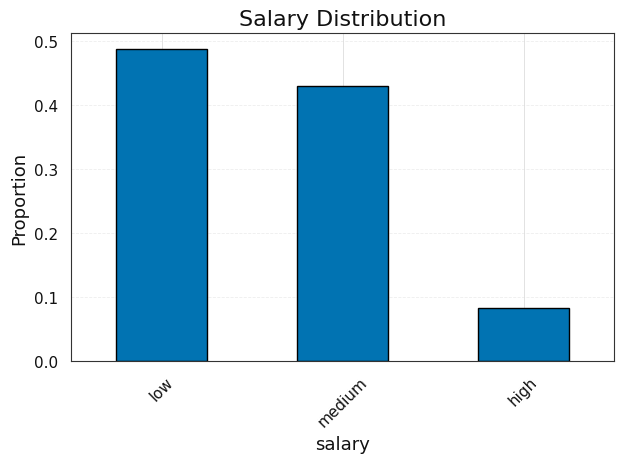
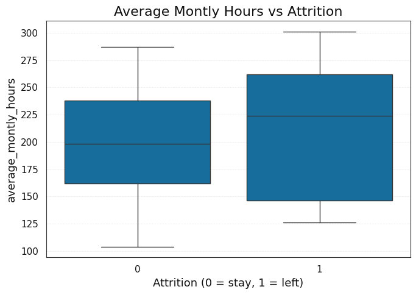
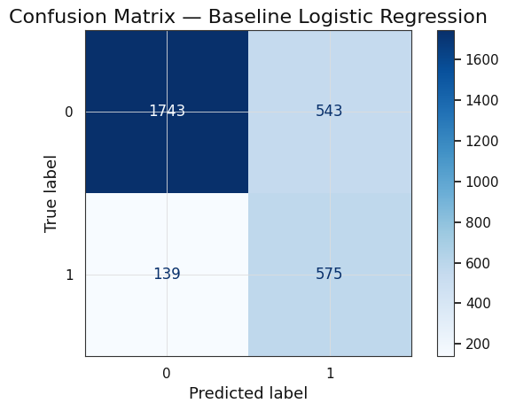

# Executive Summary

**Project:** Employee Attrition Analysis
**Owner:** Katherine Ygbuhay
**Updated:** October 2025

---

## Business Objective
Salifort's leadership asked: *"Why are employees leaving, and what can we do to reduce attrition?"*
The business goal is to identify key drivers of turnover and develop a predictive model to guide proactive retention strategies.

---

## Dataset Overview
The dataset represents HR records of employees (n ≈ 15k), including demographic, performance, and workplace attributes.

**Highlights:**
- **Imbalance:** Only ~23–25% of employees left.
- **Departments:** Sales, technical, and support functions dominate the workforce.
- **Sensitive proxies:** Salary bands and department may indirectly encode equity concerns.

---

## Approach Summary
We followed a structured pipeline:

1. **EDA:** Explored attrition patterns across satisfaction, workload, and department.
2. **Baseline model:** Logistic regression with balanced class weights.
3. **Tree-based models:** Random Forest and XGBoost for non-linear patterns.
4. **Model selection:** Chose champion via validation metrics (ROC-AUC prioritized, with F1/recall tie-breakers).
5. **Ethics review:** Identified bias risks, proxy variables, and mitigations.

---

## Key Findings
- **Satisfaction level is the single strongest predictor:** Employees with low satisfaction are disproportionately likely to leave.
- **Tenure and workload interact:** Short tenure + high projects correlate with attrition risk.
- **Department matters:** Sales and support see elevated attrition rates compared to R&D or management.

---

## Model Performance (Lay Translation)
- **Champion model:** Random Forest (after comparing to Logistic Regression).
- **Validation ROC-AUC ~0.85:** The model can correctly rank leavers vs. stayers 85% of the time.
- **Recall ~0.72 for "leavers":** Roughly 7 out of 10 at-risk employees are identified.
- **Interpretability trade-off:** Logistic regression is simpler, but trees provide better recall and stability.

---

## Actionable Recommendations
- **Retention focus:** Target interventions for low-satisfaction and high-project-load employees.
- **Manager training:** Equip supervisors in sales/support to detect early risk signals.
- **Workload balancing:** Monitor projects per employee, especially in first 1–2 years.
- **Policy safeguards:** Use model output for supportive outreach, not punitive actions.

## Conclusion
This analysis shows that attrition at Salifort is **driven most strongly by low satisfaction, early tenure, and workload imbalances**, with department-level disparities. A Random Forest model provides a strong predictive foundation, but success depends on **responsible use**: coupling predictions with human judgment, regular monitoring, and ethical safeguards.

---

## Appendix: Additional Figures

### Salary Distribution

### Numeric Feature Distributions

### Last Evaluation vs Attrition

### Average Monthly Hours vs Attrition

### Time Spent at Company vs Attrition

### Correlation Heatmap

### Baseline Confusion Matrix

### Baseline ROC Curve

### Top Logistic Regression Coefficients

### ROC Curves - Tree Models

### Feature Importance (Tree Models)

### Feature Importance (Tree Models) 2

### Feature Importance (Tree Models) 3

### Precision-Recall Curve

### Attrition by Salary Band (Ethics)
