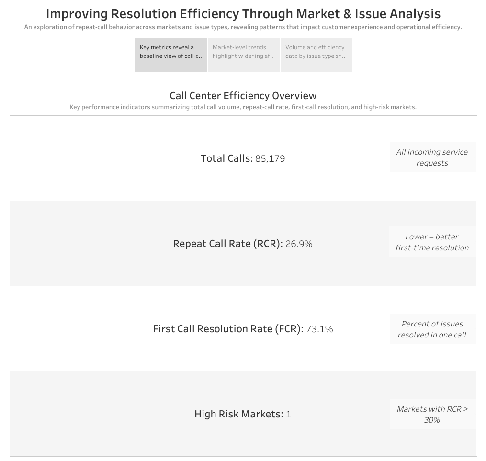
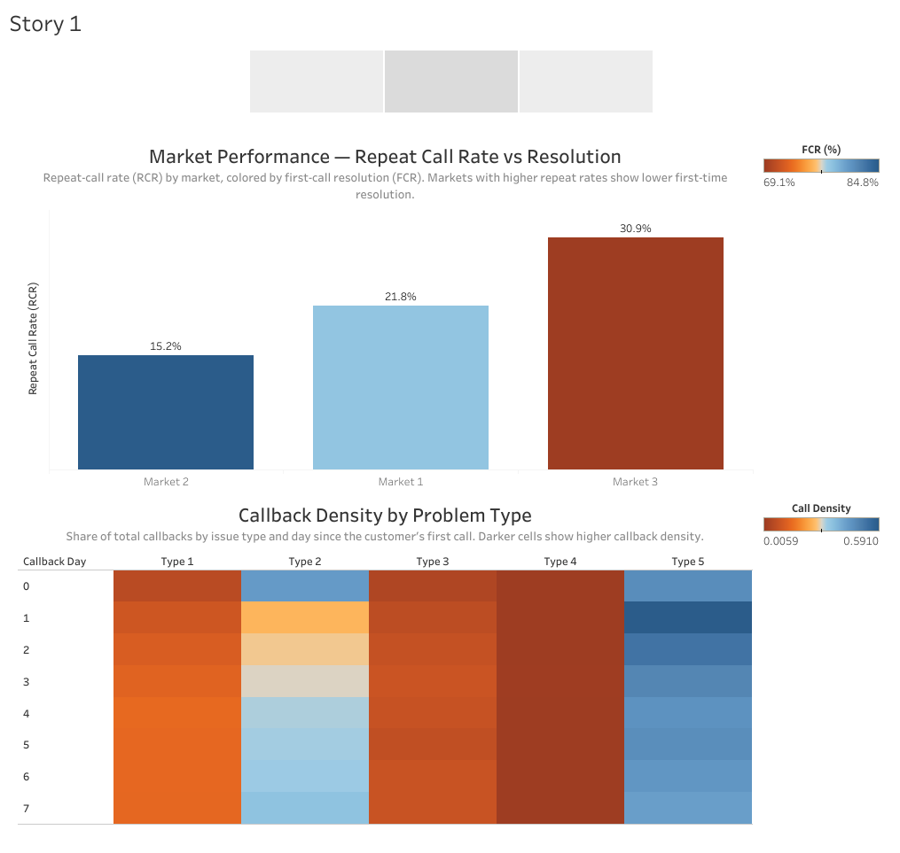
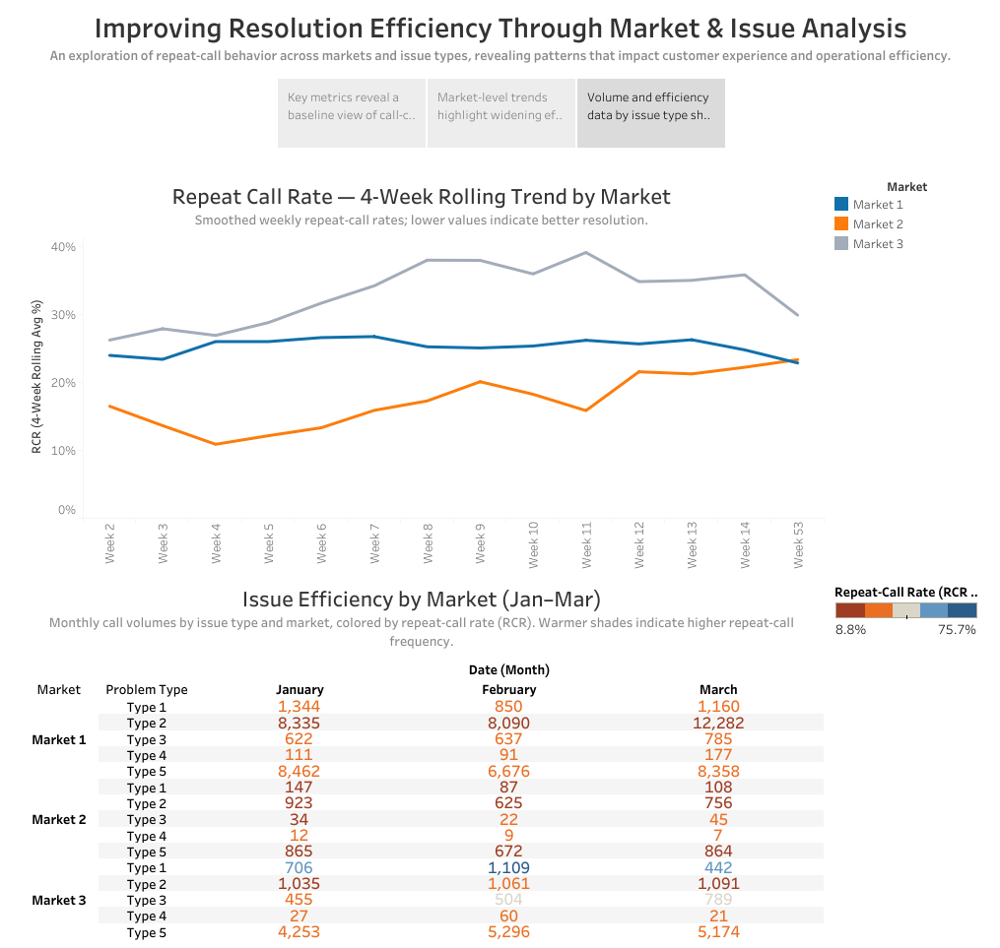

# Google Fiber BI Case Study — Repeat Calls Analysis

📅 *Google Business Intelligence Capstone*

## 🎯 Objective
Analyze repeat customer support calls across multiple markets to identify patterns that affect **First Contact Resolution (FCR)** and **Repeat Call Rate (RCR)**.

## 🧩 Key Metrics
| Metric | Formula | Meaning |
|---------|------------------------------|----------|
| Repeat Call Rate (RCR) | repeat_calls ÷ total_calls | Inefficiency indicator |
| First Contact Resolution (FCR) | 1 − RCR | Operational success rate |

## 🧠 Highlights & Insights
- Market 3 shows materially higher **RCR** than peers — likely operational bottlenecks (e.g., technician scheduling).  
- A February process update coincides with a **~5pp drop in RCR**, suggesting positive impact.  
- **Internet/WiFi** issues (Type 5) are the largest driver of repeats → priority for script/training updates.

> See detailed bullets in [`docs/insights_summary.md`](docs/insights_summary.md).

## 📊 Dashboard
**Tableau Public:** https://public.tableau.com/shared/7NN3FQ944?:display_count=n&:origin=viz_share_link

### Previews




## 🧰 Tech Stack
BigQuery (SQL) · Tableau Public (viz) · Markdown (docs)

## 🧾 Reproducibility
- SQL pipeline: [`sql/01_union_all.sql`](sql/01_union_all.sql), [`sql/02_kpi_calculations.sql`](sql/02_kpi_calculations.sql), [`sql/03_long_form_rollups.sql`](sql/03_long_form_rollups.sql)
- Data dictionary: [`docs/data_dictionary.md`](docs/data_dictionary.md)
- Raw files: `data/raw/` · Processed: `data/processed/`

## 📂 Repo Map
```
call_center_customer_satisfaction/
├─ README.md
├─ assets/
│  ├─ dashboard.pdf
│  ├─ improving_resolution_story_1.png
│  ├─ improving_resolution_story_2.png
│  └─ improving_resolution_story_3.png
├─ data/
│  ├─ raw/
│  └─ processed/
├─ docs/
│  ├─ data_dictionary.md
│  └─ insights_summary.md
└─ sql/
   ├─ 00_data_summary.sql
   ├─ 01_union_all.sql
   ├─ 02_kpi_calculations.sql
   └─ 03_long_form_rollups.sql
```

— _Last polished on 2025-10-10_
